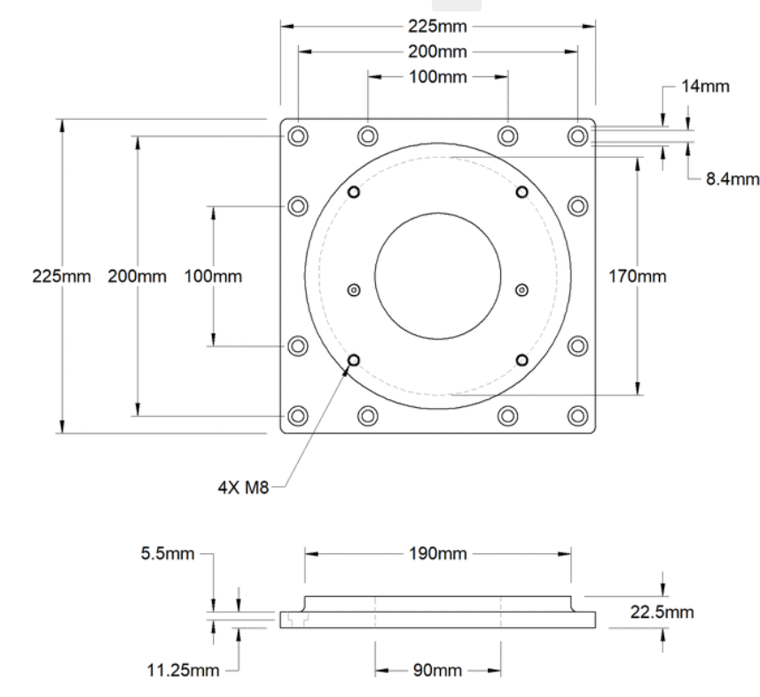
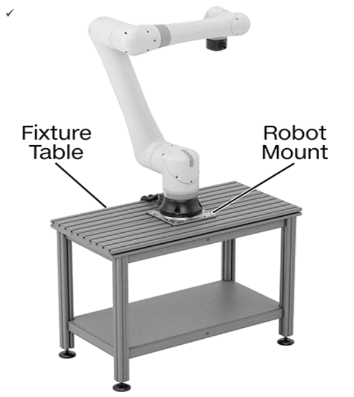
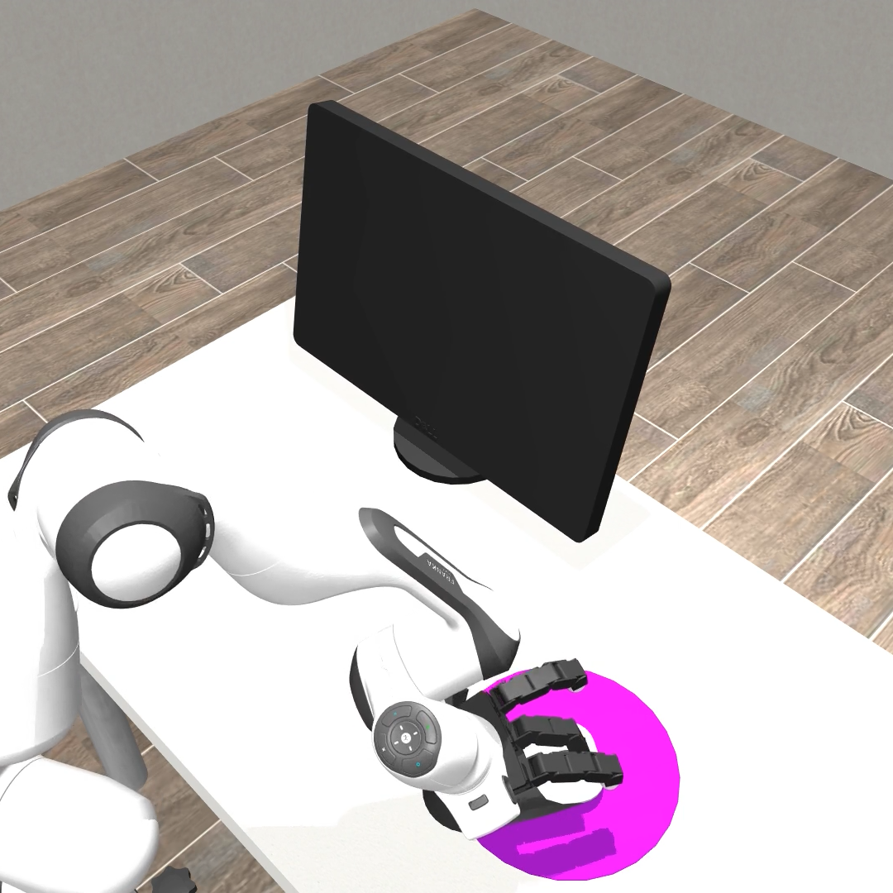

# CR3 + CRAFT Teleoperation in DexJoCo

This repository is a curated showcase of my CR3 + CRAFT hand integration and
teleoperation experiments built around DexJoCo/MuJoCo.

The goal was to replace the original Panda/Allegro style setup with a CR3
6-axis robot arm and a CRAFT dexterous hand, then test practical human input
sources for teleoperation.


## Highlights

- Integrated a CR3 arm + CRAFT hand into DexJoCo-style MuJoCo environments.
- Built a unified 22D action interface:

```text
action[0:3]   -> target_xyz
action[3:7]   -> target_quat_wxyz
action[7:22]  -> craft15 finger commands
```

- Created three CR3+CRAFT env variants:
  - `Cr3CraftReachDebugEnv`
  - `Cr3CraftClickMouseEnv`
  - `Cr3CraftClickMouseShellEnv`
- Ported the click-mouse task scene into a CR3+CRAFT shell environment.
- Added MediaPipe hand teleoperation:
  - palm motion -> TCP Y/Z
  - finger curl -> CRAFT hand commands
  - keyboard override -> TCP X forward/backward
- Added a dual-camera MediaPipe prototype:
  - front camera -> Y/Z + CRAFT
  - side camera -> X
- Added a Quest/WebXR MVP architecture for future controller-based teleop.
- Built a lightweight Windows `uv` environment that avoids HaMeR/PyTorch.

## Why This Exists

Single-camera teleoperation is fragile when forward/backward depth is required.
HaMeR provides richer 3D hand reconstruction, but it was too slow and heavy for
the first usable teleop loop.

The practical direction became:

```text
DexJoCo CR3+CRAFT backend
  + MediaPipe hand tracking for simple Y/Z and fingers
  + keyboard or second camera for X depth
```

This keeps the robot control path simple and testable while leaving room for
Quest/controller tracking or better depth sensors later.

## Repository Layout

```text
assets/
  images/    rendered screenshots and reference photos
  gifs/      short MuJoCo teleop animation

src/
  envs/      CR3+CRAFT DexJoCo environment classes
  xmls/      CR3+CRAFT MuJoCo scene XMLs
  scripts/   teleop, smoke-test, and Windows uv scripts
  tasks/     Quest teleop mapping prototype
  tests/     small validation tests

docs/
  integration status, audit report, handoff notes, Windows uv setup

tools/
  render_showcase_media.py
```

## Current Best Demo

Windows PowerShell:

```powershell
cd E:\material_for_uci_experiment\DexJoCo-CRAFT-Teleop
.\scripts\setup_windows_uv_mediapipe.ps1

.\scripts\run_mediapipe_cr3_windows_uv.ps1 -CameraId 0
```

Equivalent raw command:

```powershell
.\.venv-mediapipe-win\Scripts\python.exe scripts\mediapipe_cr3_craft_click_mouse_shell.py `
  --camera-id 0 `
  --viewer `
  --preview `
  --keyboard-x-step 0.01
```

Controls:

```text
Palm left/right/up/down -> TCP Y/Z
Fingers -> CRAFT hand
Z or numpad 7 -> TCP X-
X or numpad 9 -> TCP X+
H or numpad 5 -> clear keyboard X offset
R -> recalibrate
Q/Esc -> quit
```

## Dual-Camera Prototype

When two ordinary webcams are available:

```powershell
.\scripts\run_dual_mediapipe_cr3_windows_uv.ps1 `
  -FrontCameraId 0 `
  -SideCameraId 1
```

Mapping:

```text
front camera -> TCP Y/Z + CRAFT finger commands
side camera  -> TCP X forward/backward
```

If X direction is reversed:

```powershell
.\scripts\run_dual_mediapipe_cr3_windows_uv.ps1 -SideXSign -1
```

## Validation

The CR3+CRAFT backend was smoke-tested through:

```bash
python scripts/smoke_cr3_craft_envs.py --env all --steps 2
python scripts/smoke_cr3_craft_envs.py --env click_mouse_shell --steps 5 --render-check
```

The Windows MediaPipe uv environment was checked with:

```text
uv venv creation passed
pip check passed
mediapipe script --help passed
DexJoCo env reset/step passed: action_shape (22,), tcp_error 0.0
```

## Media

Reference mechanical layout images:





Rendered task references:



## What Is Original Here

The original work in this showcase is the integration and teleoperation layer:

- CR3+CRAFT environment wrappers and XML integration
- click-mouse shell environment adaptation
- 22D action interface for CR3 + CRAFT
- MediaPipe teleop scripts
- dual-camera teleop prototype
- Quest/WebXR teleop MVP
- Windows uv environment setup for lightweight testing
- integration audit and handoff documentation

This project builds on DexJoCo, MuJoCo, MediaPipe, and related open-source
ecosystem components.

## Not Included

This curated repository intentionally does not include:

- HaMeR model weights or full HaMeR checkout
- MobileHand clone or pretrained model files
- PyTorch training/distillation artifacts
- Meta Quest Developer Hub installer
- large CAD/SolidWorks assets
- local virtual environments

## Notes

This is a research/prototyping showcase, not a polished robotics product.
The environment layer is much more mature than the teleop layer.  The most
important remaining question is which human input source gives the most stable
and natural control.

