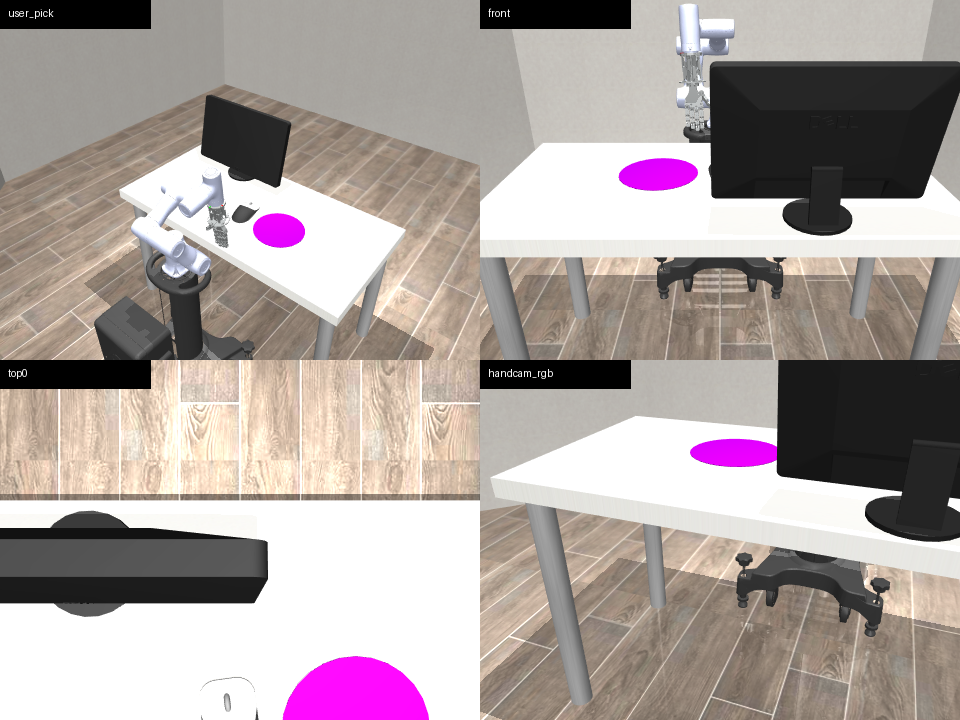

# CR3 × CRAFT 遥操作展示

[English](README.md) · [中文版](README.zh-CN.md)

这是 CR3 六轴机械臂与 CRAFT 灵巧手在 DexJoCo/MuJoCo 中的集成、任务环境和遥操作实验仓库。

> 本仓库是从完整实验工作区整理出的展示版和交接版，包含 CR3+CRAFT 环境适配、MuJoCo 场景、遥操作脚本、测试、文档和少量展示媒体。完整 DexJoCo 主工程、第三方模型权重、CAD 文件和本地环境不会上传。




## 项目定位

项目的核心目标是：把 DexJoCo 中原本面向 Panda/Allegro 的任务环境替换为 CR3 机械臂和 CRAFT 灵巧手，并让 MediaPipe、键盘、双摄像头和 Quest 等输入方式使用同一套动作接口。

```text
MediaPipe / 键盘 / 双摄像头 / Quest
                ↓
      末端位姿 + 手指控制量
                ↓
             22D action
                ↓
        CR3 + CRAFT 环境
                ↓
       MuJoCo 仿真和任务反馈
```

## 22 维动作接口

```text
action[0:3]   = target_xyz        # 末端目标位置
action[3:7]   = target_quat_wxyz  # 末端目标姿态，顺序为 wxyz
action[7:22]  = craft15           # CRAFT 五指的 15 个直接控制量
```

外部使用 15 个手指控制量，内部 CRAFT 包含 20 个关节；远端 DIP 关节通过 MuJoCo equality 约束跟随对应的 PIP 关节。

## 三个环境

| 环境 | 用途 |
| --- | --- |
| `Cr3CraftReachDebugEnv` | 最小化调试 CR3 末端 IK、位置控制和手指响应 |
| `Cr3CraftClickMouseEnv` | 独立点击鼠标任务，适合快速开发 |
| `Cr3CraftClickMouseShellEnv` | 主线环境，保留 DexJoCo/Panda arena 并替换为 CR3+CRAFT |

推荐使用 `Cr3CraftClickMouseShellEnv` 作为主线环境。它包含鼠标和鼠标垫随机化、点击检测、显示器反馈和成功计数。

## 遥操作方式

### MediaPipe 单摄像头

- 手掌移动控制 TCP Y/Z；
- 手指弯曲控制 CRAFT 15 维手指动作；
- 键盘补偿 TCP X 深度；
- 包含校准、滤波、死区和最大步长限制。

这是轻量、可运行的遥操作原型，不是严格的三维手部重建；单目深度是主要限制。

### 双摄像头

```text
正面摄像头 → TCP Y/Z + CRAFT 手指
侧面摄像头 → TCP X
```

这是工程化的双视角 2D 映射，不是经过标定的双目重建。

### 键盘控制

```text
Z / 小键盘 7  → TCP X-
X / 小键盘 9  → TCP X+
H / 小键盘 5  → 清除 X 偏移
R             → 重新校准
Q / Esc       → 退出
```

### Quest / WebXR

`dexjoco/tasks/quest_teleop.py` 是 Quest 3 WebXR 桥接原型，负责位姿接收、四元数转换、相对运动、位置平滑、抓握映射和 WebSocket 通信。目前仍属于实验性接口。

## 仓库结构

```text
assets/       展示图片和 GIF
docs/         架构、审计、交接和环境说明
dexjoco/      可直接导入的 Python 包、控制器、环境和 MuJoCo 资源
scripts/      键盘、MediaPipe、双摄像头和 Quest 入口
configs/      CR3+CRAFT 遥操作配置
tests/        轻量测试
tools/        展示媒体渲染工具
```

## 运行前提

这个仓库已经包含 CR3+CRAFT 仿真所需的 Python 包、控制器、机械臂和手部网格、鼠标/显示器资源、任务 XML、脚本和安装配置，可以直接 clone 后使用。
除点击鼠标场景外，还包含抓锤子敲钉子、抓水桶、使用夹子、浇花和折叠眼镜五个操作任务。

仓库已经包含轻量级 MediaPipe `hand_landmarker.task` 模型，直接 clone 后即可运行摄像头方案。

Windows 下建议把仓库 clone 到只含 ASCII 字符的路径，例如 `E:\\src\\Dexjuco_cr3_crafthand`。MuJoCo 在包含中文目录的路径下加载 XML 资源时可能失败。

```powershell
cd <CLONE_DIR>
.\scripts\setup_windows_uv_mediapipe.ps1
.\scripts\run_mediapipe_cr3_windows_uv.ps1 -CameraId 0
python scripts/smoke_cr3_craft_tasks.py
```

双摄像头运行：

```powershell
.\scripts\run_dual_mediapipe_cr3_windows_uv.ps1 -FrontCameraId 0 -SideCameraId 1
```

## 当前完成度

已经完成或基本完成：CR3+CRAFT MuJoCo 场景、三个环境、统一 22D action、CRAFT 远端关节耦合、click-mouse 任务适配、键盘/MediaPipe/双摄像头入口、Quest/WebXR 动作映射原型、冒烟测试和交接文档。

仍属于实验阶段：手到机器人坐标标定、单目深度、双摄像头 X 映射、Quest 真实浏览器连接、HaMeR/MobileHand 完整接入、真实硬件闭环和 Sim2Real 安全验证。

## 文档

- [架构与代码导览](docs/architecture_guide.md)
- [DexJoCo 集成状态](docs/cr3_craft_dexjoco_integration_status.md)
- [集成审计报告](docs/cr3_craft_dexjoco_integration_audit.md)
- [遥操作交接记录](docs/cr3_craft_teleop_handoff.md)
- [Windows + uv + MediaPipe](docs/windows_uv_mediapipe_env.md)
- [Quest 3 WebXR MVP](docs/quest3_teleop_mvp.md)
- [发布边界](PROJECT_SCOPE.md)
